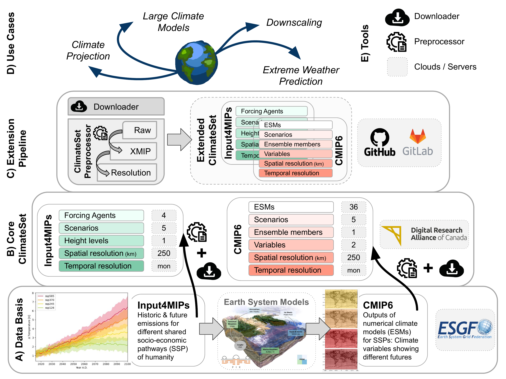
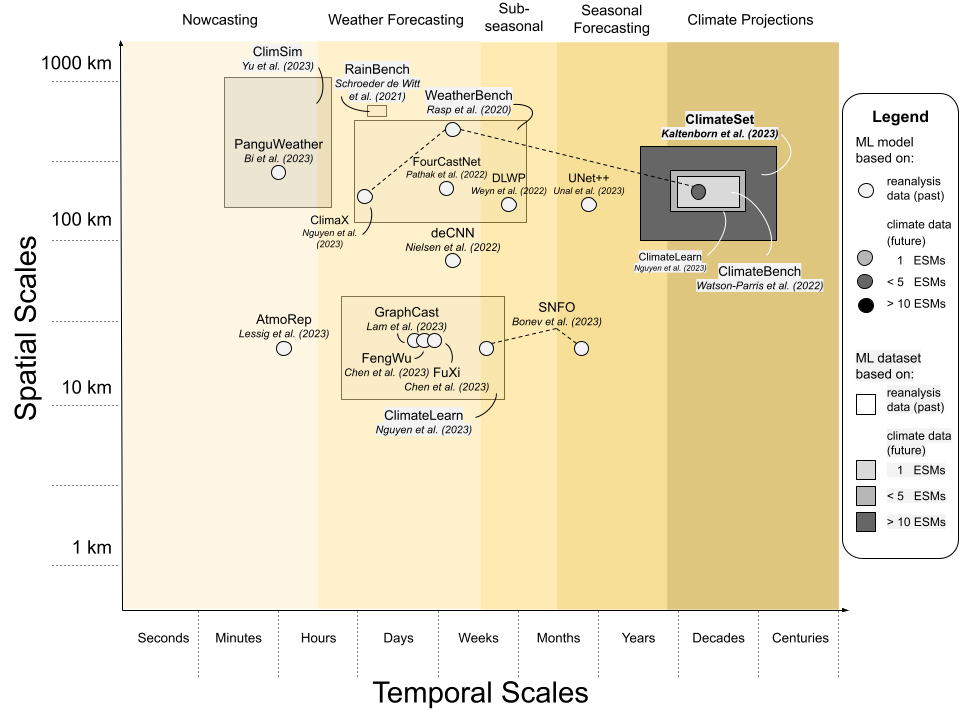

<h1>This website is currently under development!</h1>

    <b>The links to the code and the dataset will be published in December 2023. Feel free to reach out to julia[dot]kaltenborn[at]mail[dot]mcgill[dot]ca to get prior access to the data.</b>

 

<!-- 

  
  

    Climate models are critical tools for analyzing climate change and projecting its 
    future impact. The machine learning (ML) community has
    taken an increased interest in supporting climate scientists’ efforts on various tasks
    such as climate model emulation, downscaling, and prediction tasks. However, 
    traditional datasets based on single climate models are limiting. We thus present 
    ClimateSet — a comprehensive collection of inputs and outputs from 36 climate models 
    sourced from the Input4MIPs and CMIP6 archives, designed for large-scale ML applications.
  

 -->

  

    
  

  

    Climate models are critical tools for analyzing climate change and projecting its 
    future impact. The machine learning (ML) community has
    taken an increased interest in supporting climate scientists’ efforts on various tasks
    such as climate model emulation, downscaling, and prediction tasks. However, 
    traditional datasets based on single climate models are limiting. We thus present 
    ClimateSet — a comprehensive collection of inputs and outputs from 36 climate models 
    sourced from the Input4MIPs and CMIP6 archives, designed for large-scale ML applications.
  

# Overview

1. **ClimateSet builds on the Input4MIPs and CMIP6 datasets** made available through multiple climate modeling teams on the Earth System Grid Federation (ESGF) servers.
2. **ClimateSet consists of a preprocessed, ML-ready core dataset** that includes inputs and outputs for 5 SSP scenarios, 4 forcing agents, 2 climatic variables (temperature and precipitation), for a set of 36 climate models. It is currently made publicly available through the Digital Research Alliance of Canada.
3. **The core dataset can be extended** to include different variables, height levels, ensemble members, scenarios, and any other information made available from climate models on the CMIP6 server of ESGF. The downloader and preprocessing pipelines are available on our GitHub repository.
4. **Potential use cases for ClimateSet** range from climate projection to climate data downscaling, extreme weather prediction in different warming scenarios, to large ML climate models.
5. **The main tools** provided through ClimateSet are the downloader and the preprocesser to make the climate model data consistent with each other.

*The [3D Earth System Model visualization](https://www.pik-potsdam.de/en/news/latest-news/fast-comprehensive-potsdam-earth-model-poem-ready-for-use) was created by Boris Sakschewski, used with permission.*

# Why Climate Model Data?
Most recent works are building upon ERA5 data, i.e. reanalysis data or "past observational data" that was enhanced by numerical modelling. However, we need to train Large ML Climate Models, on *climate model* data, such as CMIP6. Why? Because of Climate Change! Climate change means that our data distributions are shifting over the next decades. If we want to be able to address any questions related to our future climate (which is important for climate change adaptation!), we need to train our models on climate model data. ClimateSet is providing a range of climate scenarios and climate models, so we can capture the uncertainty about our future climate, as well as the uncertainty of climate models themselves.

# Related Work

Depending on your specific task, there might be other datasets that are more suitable for you. We are providing a list of different climate model datasets and tools here that might be helpful to you. Feel free to reach out to us if you think there is a dataset or ML model that is missing in our figure. (We are only including datasets and ML models that operate on a global scale, using reanalysis or climate model data).

*The figure was inspired by [Mukkavilli et al. (2023)](https://arxiv.org/abs/2309.10808).*

## Tools
- [xMIP](https://github.com/jbusecke/xMIP): Preprocessing tool for CMIP6 data; great start to engineer your own pipelines
  
## Datasets
- [ClimateLearn](https://arxiv.org/abs/2307.01909) Accessible, large-scale weather data + 2 climate models, PyTorch package; especially suitable when looking for dataset + ML models
- [ClimSim](https://arxiv.org/abs/2306.08754) High-resolution, large-scale, accessible ML-ready dataset for 1 climate model; especially suitable for hybrid physics-ML emulation tasks
- [ClimateBench](https://agupubs.onlinelibrary.wiley.com/doi/full/10.1029/2021MS002954) Accessible, ML-ready climate dataset for 1 climate model (NorESM)
- [WeatherBench](https://arxiv.org/abs/2002.00469) Large-scale, accessible, ML-ready weather dataset

# News
- 12th Dec 2023: [Poster Session Neurips](https://nips.cc/virtual/2023/poster/73703)
- 08th Dec 2023: [Mila Interview](https://mila.quebec/en/ai-climate/)

  
# Ethics Statement
ClimateSet can be used to train large-scale climate model emulators, however, it can also be used for many other ML tasks with currently unknown downstream effects. This means, that there is a considerable amount of uncertainty regarding the potential misuse and negative downstream effects of ClimateSet.

The authors intend that the data is only used for projects that can clearly scope the potential social and environmental impacts and do not harm the environment or humans in direct or indirect ways. For example, you may not use the dataset to train an ML model that identifies which geographical locations are particularly robust to climate change and can be used for resource extraction (mining, oil, gas, etc.). This would have a negative impact on our environment and thus violates our intended use of ClimateSet. Another example would be, that you are not allowed to use the dataset in a financial context, such as estimating the projected financial damage due to climate change for different local regions. This could be used to increase the financial burden on marginalized communities that are usually living in regions that are at greater risk of climate change. This would have a negative impact on the social level and humans in general.

ClimateSet has potential hazards regarding the data it provides, i.e. there are potential mistakes both from our side and the climate modelling teams. Our team maintains the data as well as possible, i.e. we address data mistakes when we find them when brought to our attention. We are updating our dataset when it comes to our attention that our underlying datasets have been updated to address mistakes / serious issues. We have been collaborating interdisciplinary with climate scientists to minimize the risk of introducing mistakes due to a lack of domain knowledge.

We encourage users of ClimateSet to include climate scientists in their teams to ensure that they use the data correctly. We will update our website later on with more detailed descriptions of how to use the dataset correctly and outlining potential pitfalls for ML researchers working on climate model data. Right now, we do not provide such a guideline yet. Thus, please reach out to us if you have questions or you are uncertain about the correct usage of ClimateSet. In any case, we recommend including researchers with relevant domain knowledge to ensure the correct use of the data and to make sure your project is addressing challenges that are actually relevant to the domain.

# Leaderbord
For a current leaderboard, please refer to our paper.
For future experiments, you will find a leaderboard here. 
If you have made your own experiments with ClimateSet and wish to share your results, please don't hesitate to contact us and we will publish your results on our websites accordingly for anyone to find.

